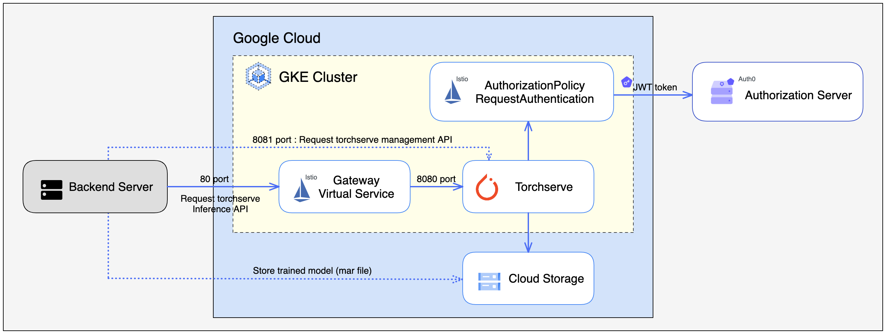

# Prerequisite
- Python >= 3.8
- [Docker](https://docs.docker.com/get-docker/)
- [Google GKE Cluster](https://github.com/pytorch/serve/blob/master/kubernetes/README.md#-Torchserve-on-Kubernetes), [Cloud Storage](https://cloud.google.com/storage)
- [Istio](https://istio.io/latest/docs/setup/getting-started/)
- [Auth0 m2m application](https://auth0.com/)
- [cdk8s, pipenv](https://cdk8s.io/docs/latest/getting-started/)

# Architecture


# How to use
## Deploy pytorch/serve 
#### 1. Move to torchserve directory
  ```bash
    cd torchserve
  ```

#### 2. Generate k8s manifest with cdk8s
  - Install pip requirements
  - Import istio crd
  - Generate k8s manifests in "dist/"
  ```bash
    pipenv install 
    cdk8s import crds/istio_crds.yaml
    cdk8s synth
  ```

#### 3. Deploy
  ```bash
    kubectl apply -f dist/
  ```

## Serving model with pytorch/serve 
#### 1. Move to model directory
  ```bash
    cd model
  ```

#### 2. Register sample model
  ```bash
    docker build -f huggingface_transformers.Dockerfile \
      -t torchmodelarchiver \
      --build-arg now="$(date +%G%m%d_%H%M%S)" \
      --build-arg version=1.0 \
      .
  ```

#### 3. Test
  ```
    curl -X POST http://{ingressgateway IP}/pytorch/predictions/BERTSeqClassification \
      -T sample/sample_text_captum_input.txt \
      --header 'authorization: Bearer {token}'
  ``` 

# Test scenario and Sample test result [[link](https://www.notion.so/chloenoh/torchserve-app-cee738e75961435088fb0947d91aec80)]
